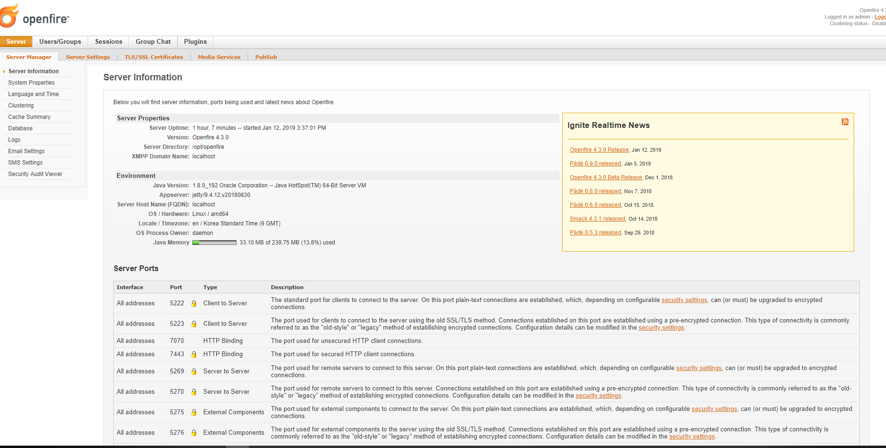

openfire 설치방법
==============

참고 [링크](https://www.vultr.com/docs/how-to-setup-an-openfire-xmpp-server-on-centos-7) 

### CentoS 7에 Openfire 4.3.0 설치

참고: https://www.vultr.com/docs/how-to-setup-an-openfire-xmpp-server-on-centos-7

On the official Openfire download page, find the direct download URL pointing to the latest stable release of Openfire x86_64 RPM package.
Next, use the following commands to download and rename the Openfire RPM package.

cd
wget 'https://www.igniterealtime.org/downloadServlet?filename=openfire/openfire-4.3.0-1.x86_64.rpm' -O openfire-4.3.0-1.x86_64.rpm

With the help of the YUM package manager, you can easily install Openfire as follows. Be aware that the required JRE environment is bundled in this Openfire release, so you don't need to setup Java by yourself.

sudo yum install -y openfire-4.3.0-1.x86_64.rpm
Openfire will be installed in the /opt/openfire directory.

Finally, start the Openfire service and make it automatically start on boot.

sudo systemctl start openfire.service
sudo systemctl enable openfire.service

In the MySQL shell, use the following commands to create a database, openfire, a database user, openfireuser, and its password, yourpassword.

암호는 바꾸세요

CREATE DATABASE openfire;
CREATE USER 'openfireuser'@'localhost' IDENTIFIED BY '암호입력';
GRANT ALL PRIVILEGES ON openfire.* TO 'openfireuser'@'localhost' IDENTIFIED BY '암호입력' WITH GRANT OPTION;
FLUSH PRIVILEGES;

Before you can setup the Openfire XMPP server on its web interface, you need to open the port 9090 by modifying firewall rules.

sudo firewall-cmd --zone=public --permanent --add-port=9090/tcp
sudo firewall-cmd --reload

Admin 에 접속 성공
VirtualBOX의 포트포워딩 9090이고 192.168.56.1인 경우

http://192.168.56.1:9090/setup/index.jsp

